# Introduction

This repository contains a JAX re-implementation of the Message-Passing Neural Network model introduced in K. Rusek, P. Chołda, *“Message-Passing Neural Networks Learn Little’s Law”*. The code is based on the authors’ original TensorFlow 1 implementation and was developed as part of the engineering thesis **“Reproducibility of results from paper Message-Passing Neural Networks Learn Little's Law implemented in JAX”** supervised by dr inż. Krzysztof Rusek.

The JAX implementation is provided in two APIs: **Flax Linen** and **Flax NNX**, allowing a direct comparison of modern JAX frameworks.

Below we present instructions on how to run our code and compare the results obtained by the original TensorFlow 1 model with the JAX implementations.

# How to run
Below you can find a detailed instruction on how to prepare the data, train the model, and test it.

## Generating samples

First, you need samples to train the model. To generate them, use the samples.py script, which creates three sets of samples:

-   training set

-   validation set (used during training)
    
-   test set (used after training)
    

The configuration for sample generation is located in the config.py file, with the following settings:

-   **output_dir** - directory where the generated samples will be saved
    
-   **seed** - RNG seed used during sample generation
    
-   **n_nodes** - number of nodes in the generated graphs
    
-   **train_size** — number of samples in the training set
    
-   **val_size** - number of samples in the validation set
    
-   **test_size** - number of samples in the test set
    
-   **rl** - lower bound for traffic load generation
    
-   **rh** - upper bound for traffic load generation
    
-   **graph_type** - graph type (BarabasiAlbert or ErdosRenyi)
    
-   **snd_path** - optional XML path to an SNDlib network, if samples should be generated from real topologies
    

## Training the model

Training is configured through the TrainingConfig class in config.py. The key parameters are:

-   **train_dataset_path** - directory containing the training samples
    
-   **val_dataset_path** - directory containing the validation samples
    
-   **output_path** - directory where the trained model will be saved
    
-   **batch_size** - number of graphs per batch
    
-   **learning_rate** - learning rate used during optimization
    
-   **seed** - RNG seed for training
    
-   **steps** - number of training steps
    
-   **log_interval** - how often validation is performed
    
-   **use_early_stopping** - whether to enable early stopping
    
-   **early_stopping_patience** - patience parameter for early stopping
    
-   **norm_profile** - normalization settings for μ and W depending on the graph model
    

After setting all training parameters, run one of the training scripts:

```
python train_linen.py
```

or
```
python train_nnx.py
```
  

## Testing the model

Before testing, configure the TestConfig section in config.py:

-   **test_dataset_path** - directory containing the test samples  


-   **checkpoint_path** - directory where the trained model is stored  
      
    
-   **output_path** - directory where test results will be saved  
      
    
-   **norm_profile** - same normalization settings used during training  


Run the desired test script:

```
python test_linen.py
```
Or
```
python test_nnx.py
```
  
## Test output

After testing, two plots will be saved in output_path:

### **Predicted vs. True Values**  

   A scatter plot showing how close the predicted labels are to the true labels.  
    Points aligned along the diagonal indicate accurate predictions.  
      
    
### **Histogram of Residuals**  
   A histogram showing the distribution of prediction errors (predicted - true).  
    A narrow peak near zero indicates low residuals and good model performance.
    
# Evaluation Results

Below we present the evaluation results for both JAX implementations, as well as TensorFlow 1 tested on multiple datasets, including synthetic random graphs and real topologies from **SNDlib**.

Each evaluation reports:

- **MSE**
- **R²**
- **Pearson correlation**

---

### BA / BA

| Model            |     MSE |      R² | Pearson |
| :--------------- | ------: | ------: | ------: |
| **TensorFlow 1** |  0.0069 |  0.9929 |  0.9974 |
| **JAX Linen**    |  0.0045 |  0.9953 |  0.9977 |
| **JAX NNX**      |  0.0086 |  0.9911 |  0.9958 |


<table>
  <tr>
    <th style="text-align:center;">TensorFlow 1</th>
    <th style="text-align:center;">JAX Linen</th>
    <th style="text-align:center;">JAX NNX</th>
  </tr>
  <tr>
    <td>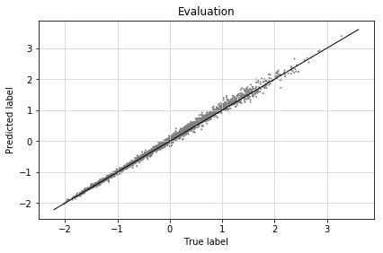</td>
    <td>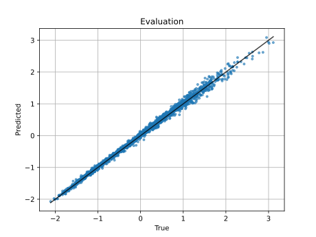</td>
    <td>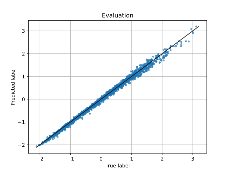</td>
  </tr>
  <tr>
    <td></td>
    <td>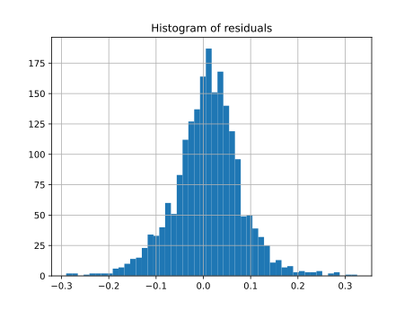</td>
    <td>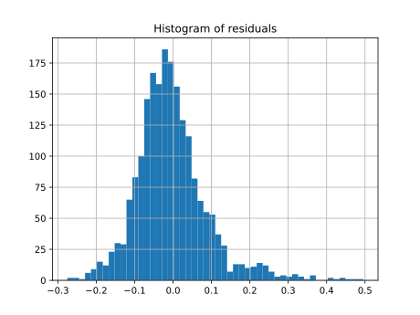</td>
  </tr>
</table>


---

### BA / ER

| Model            |    MSE |       R² | Pearson |
| :--------------- | -----: | -------: | ------: |
| **TensorFlow 1** | 11.5073 | -20.2154 |  0.8631 |
| **JAX Linen**    |  4.8763 |  -8.2365 | 0.7780 |
| **JAX NNX**      |  8.3694 |  -14.8528 | 0.8802 |
<table>
  <tr>
    <th style="text-align:center;">TensorFlow 1</th>
    <th style="text-align:center;">JAX Linen</th>
    <th style="text-align:center;">JAX NNX</th>
  </tr>
  <tr>
    <td></td>
    <td>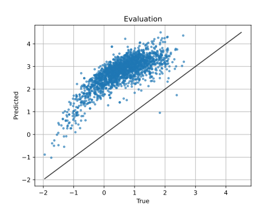</td>
    <td>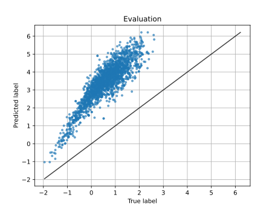</td>
  </tr>
  <tr>
    <td></td>
    <td>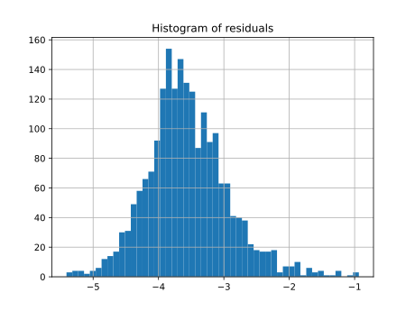</td>
    <td>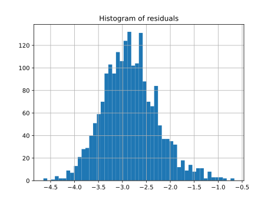</td>
  </tr>
</table>

---

### BA / ER ( ER )

| Model            |    MSE |       R² | Pearson |
| :--------------- | -----: | -------: | ------: |
| **TensorFlow 1** |  9.0614 |  -7.8326 | 0.7191 |
| **JAX Linen**    |  3.5365 |  -2.5210 | 0.7489 |
| **JAX NNX**      |  9.0358 |  -7.9961 | 0.6737 |
<table>
  <tr>
    <th style="text-align:center;">TensorFlow 1</th>
    <th style="text-align:center;">JAX Linen</th>
    <th style="text-align:center;">JAX NNX</th>
  </tr>
  <tr>
    <td>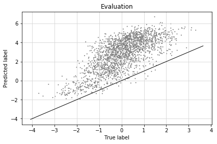</td>
    <td>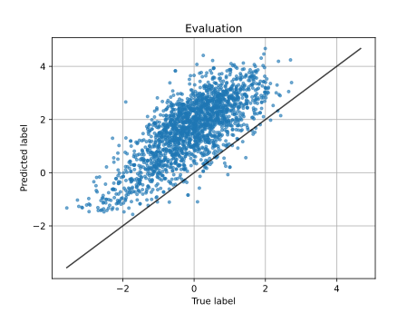</td>
    <td>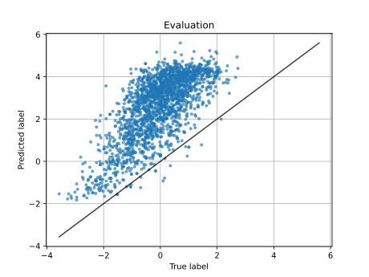</td>
  </tr>
  <tr>
    <td>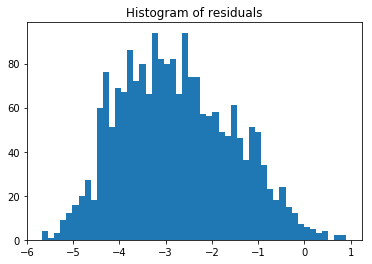</td>
    <td>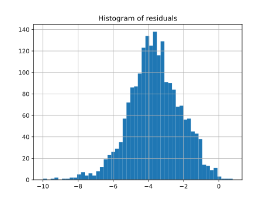</td>
    <td>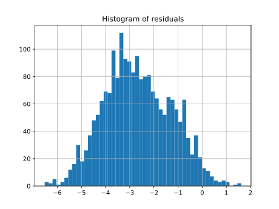</td>
  </tr>
</table>

---

### BA / germany50

| Model            |     MSE |      R² | Pearson |
| :--------------- | ------: | -------: | ------: |
| **TensorFlow 1** |   2.2480 |  -4.7743 | 0.9433 |
| **JAX Linen**    |   0.6070 |  -0.5721 | 0.4099 |
| **JAX NNX**      |   1.7945 |  -3.6471 | 0.9318 |

<table>
  <tr>
    <th style="text-align:center;">TensorFlow 1</th>
    <th style="text-align:center;">JAX Linen</th>
    <th style="text-align:center;">JAX NNX</th>
  </tr>
  <tr>
    <td>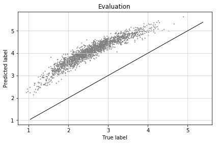</td>
    <td>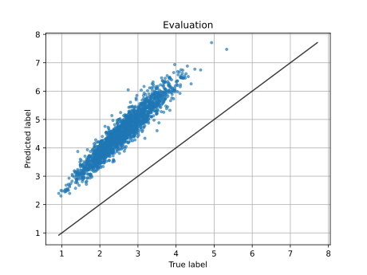</td>
    <td>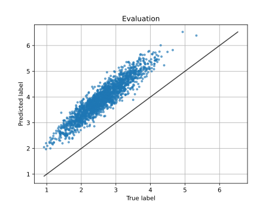</td>
  </tr>
  <tr>
    <td>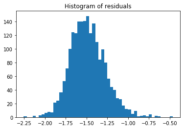</td>
    <td>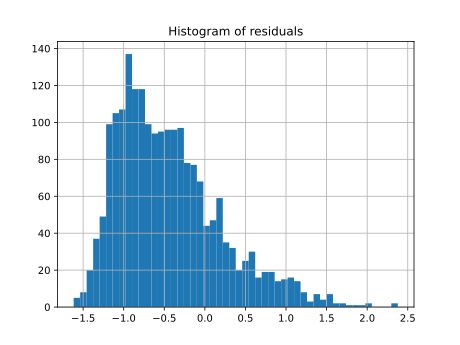</td>
    <td>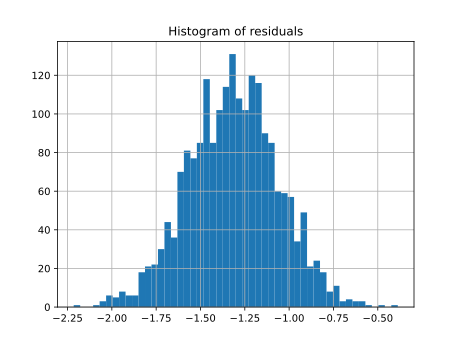</td>
  </tr>
</table>


---

### BA / SNDlib

| Model            |     MSE |       R² | Pearson |
| :--------------- | ------: | -------: | ------: |
| **TensorFlow 1** |   1.4945 |  -2.3634 | 0.5122 |
| **JAX Linen**    |   1.0193 |  -1.1309 | 0.5637 |
| **JAX NNX**      |   1.0474 |  -1.1896 | 0.5518 |


<table>
  <tr>
    <th style="text-align:center;">TensorFlow 1</th>
    <th style="text-align:center;">JAX Linen</th>
    <th style="text-align:center;">JAX NNX</th>
  </tr>
  <tr>
    <td></td>
    <td>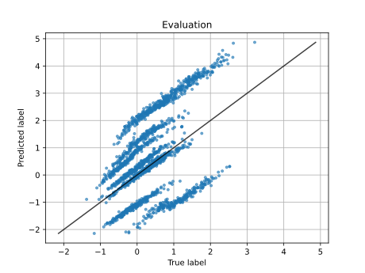</td>
    <td>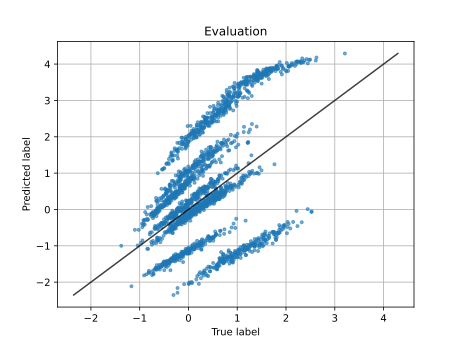</td>
  </tr>
  <tr>
    <td>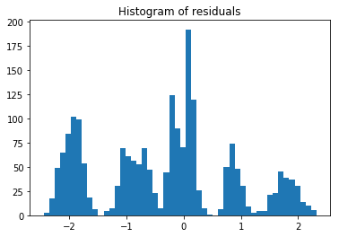</td>
    <td>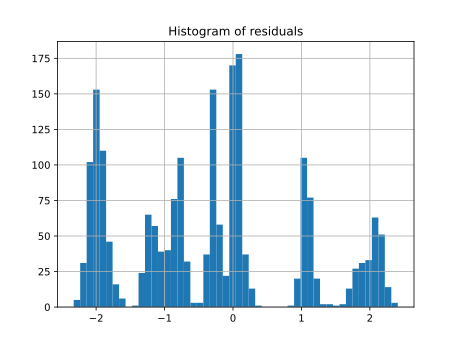</td>
    <td>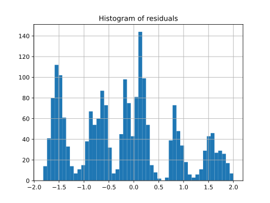</td>
  </tr>
</table>

---

### ER / ER

| Model            |     MSE |      R² | Pearson |
| :--------------- | ------: | ------: | ------: |
| **TensorFlow 1** |  0.0188 |  0.9817 |  0.9943 |
| **JAX Linen**    |  0.0128 |  0.9871 |  0.9939 |
| **JAX NNX**      |  0.0226 |  0.9774 |  0.9906 |


<table>
  <tr>
    <th style="text-align:center;">TensorFlow 1</th>
    <th style="text-align:center;">JAX Linen</th>
    <th style="text-align:center;">JAX NNX</th>
  </tr>
  <tr>
    <td>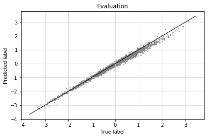</td>
    <td>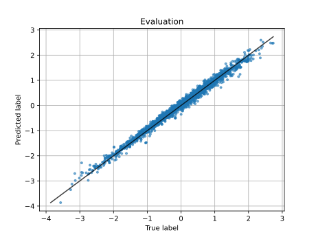</td>
    <td>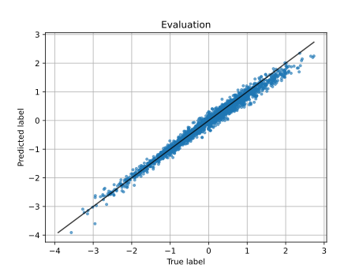</td>
  </tr>
  <tr>
    <td>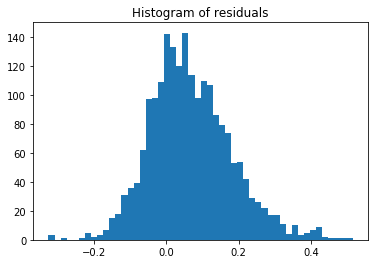</td>
    <td>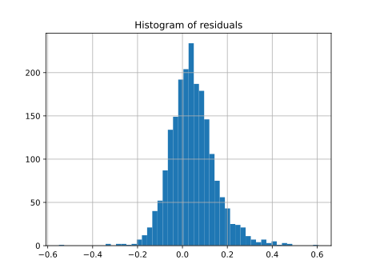</td>
    <td>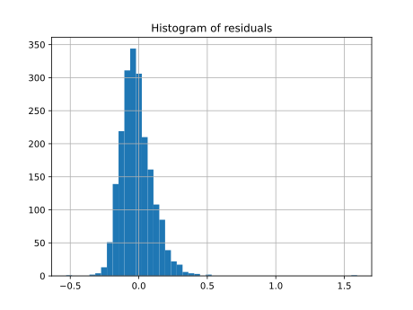</td>
  </tr>
</table>

---

### ER / BA

| Model            |    MSE |     R² | Pearson |
| :--------------- | -----: | -----: | ------: |
| **TensorFlow 1** | 0.1157 |  0.9371 | 0.9769 |
| **JAX Linen**    | 0.2291 | 0.8757 | 0.9422 |
| **JAX NNX**      | 0.2397 | 0.7472 | 0.9407 |


<table>
  <tr>
    <th style="text-align:center;">TensorFlow 1</th>
    <th style="text-align:center;">JAX Linen</th>
    <th style="text-align:center;">JAX NNX</th>
  </tr>
  <tr>
    <td>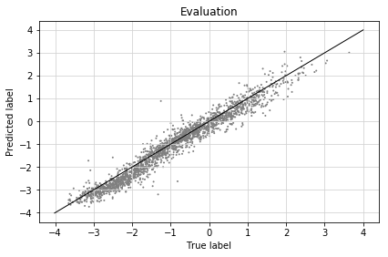</td>
    <td>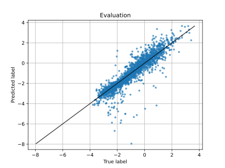</td>
    <td>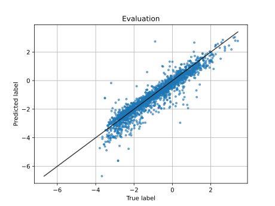</td>
  </tr>
  <tr>
    <td></td>
    <td>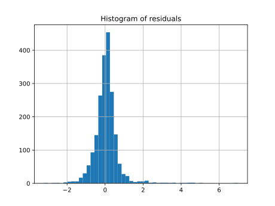</td>
    <td>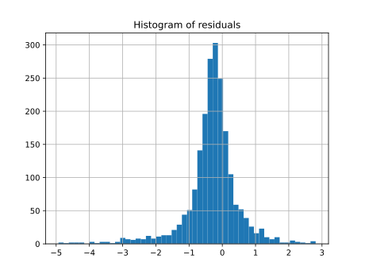</td>
  </tr>
</table>


---

### ER / ER60

| Model            |     MSE |      R² | Pearson |
| :--------------- | ------: | ------: | ------: |
| **TensorFlow 1** |  0.1146  | 0.9244	  |  0.9715 |
| **JAX Linen**    |  0.0647 |  0.9569 |  0.9798 |
| **JAX NNX**      |  0.0800 |  0.9467 |  0.9767 |


<table>
  <tr>
    <th style="text-align:center;">TensorFlow 1</th>
    <th style="text-align:center;">JAX Linen</th>
    <th style="text-align:center;">JAX NNX</th>
  </tr>
  <tr>
    <td></td>
    <td>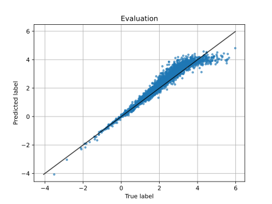</td>
    <td>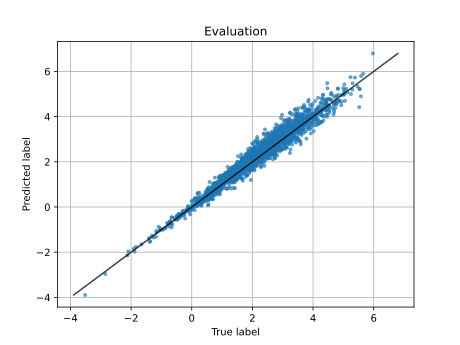</td>
  </tr>
  <tr>
    <td>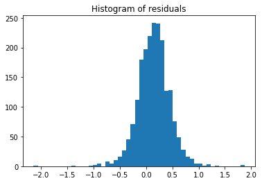</td>
    <td>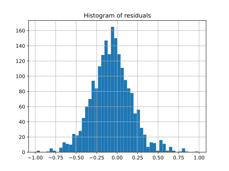</td>
    <td>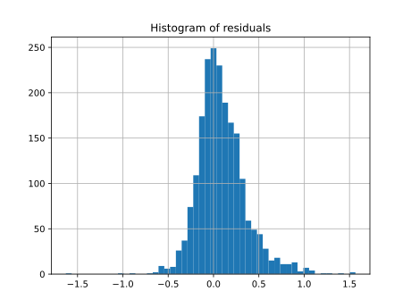</td>
  </tr>
</table>


---

### ER / janos_us

| Model            |     MSE |      R² | Pearson |
| :--------------- | ------: | ------: | ------: |
| **TensorFlow 1** |  0.0206 | 0.9468 |  0.9893 |
| **JAX Linen**    |  0.0119 | 0.9689 | 0.9871 |
| **JAX NNX**      |  0.0188 | 0.9509 | 0.9797 |

<table>
  <tr>
    <th style="text-align:center;">TensorFlow 1</th>
    <th style="text-align:center;">JAX Linen</th>
    <th style="text-align:center;">JAX NNX</th>
  </tr>
  <tr>
    <td>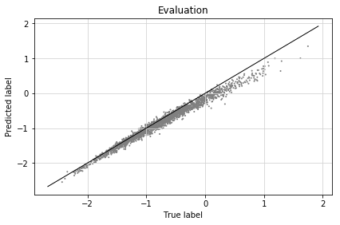</td>
    <td>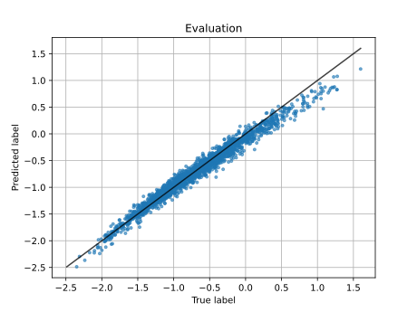</td>
    <td>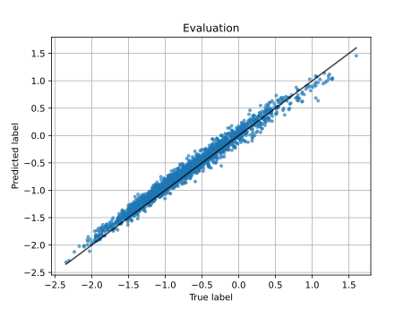</td>
  </tr>
  <tr>
    <td>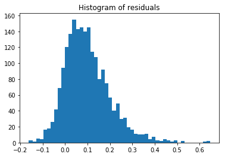</td>
    <td>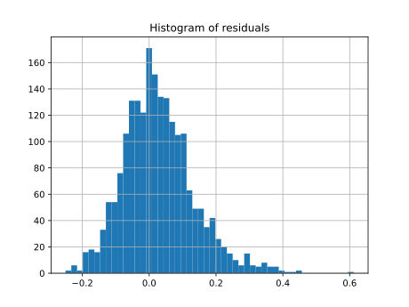</td>
    <td>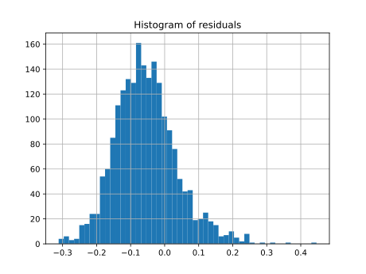</td>
  </tr>
</table>


---

### ER / germany50

| Model            |     MSE |     R² | Pearson |
| :--------------- | ------: | -----: | ------: |
| **TensorFlow 1** |  0.1946 |  0.7374 | 0.9531 |
| **JAX Linen**    |  0.1063 |  0.8552 | 0.9525 |
| **JAX NNX**      |  0.1857 |  0.7472 | 0.9594 |


<table>
  <tr>
    <th style="text-align:center;">TensorFlow 1</th>
    <th style="text-align:center;">JAX Linen</th>
    <th style="text-align:center;">JAX NNX</th>
  </tr>
  <tr>
    <td>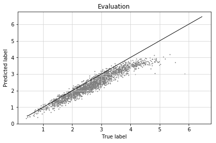</td>
    <td></td>
    <td>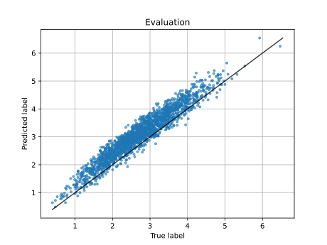</td>
  </tr>
  <tr>
    <td></td>
    <td></td>
    <td></td>
  </tr>
</table>


---

### ER / cost266

| Model            |     MSE |      R² | Pearson |
| :--------------- | ------: | ------: | ------: |
| **TensorFlow 1** |  0.0350 | 0.9362 | 0.9872 |
| **JAX Linen**    |  0.0164 | 0.9695 | 0.9852 |
| **JAX NNX**      |  0.0364 | 0.9326 | 0.9771 |

<table>
  <tr>
    <th style="text-align:center;">TensorFlow 1</th>
    <th style="text-align:center;">JAX Linen</th>
    <th style="text-align:center;">JAX NNX</th>
  </tr>
  <tr>
    <td></td>
    <td></td>
    <td></td>
  </tr>
  <tr>
    <td></td>
    <td></td>
    <td></td>
  </tr>
</table>


---

### ER / janos_us_ca

| Model            |     MSE |      R² | Pearson |
| :--------------- | ------: | ------: | ------: |
| **TensorFlow 1** |  0.0427 | 0.9259 | 0.9845 |
| **JAX Linen**    |  0.0229 | 0.9591 | 0.9816 |
| **JAX NNX**      |  0.0396 | 0.9294 | 0.9736 |


<table>
  <tr>
    <th style="text-align:center;">TensorFlow 1</th>
    <th style="text-align:center;">JAX Linen</th>
    <th style="text-align:center;">JAX NNX</th>
  </tr>
  <tr>
    <td></td>
    <td></td>
    <td></td>
  </tr>
  <tr>
    <td></td>
    <td></td>
    <td></td>
  </tr>
</table>

---

### ER / SNDlib

| Model            |     MSE |      R² | Pearson |
| :--------------- | ------: | ------: | ------: |
| **TensorFlow 1** |  0.0725 | 0.9142 | 0.9776 |
| **JAX Linen**    |  0.0538 | 0.9408 | 0.9723 |
| **JAX NNX**      |  0.0453 | 0.9501 | 0.9790 |


<table>
  <tr>
    <th style="text-align:center;">TensorFlow 1</th>
    <th style="text-align:center;">JAX Linen</th>
    <th style="text-align:center;">JAX NNX</th>
  </tr>
  <tr>
    <td></td>
    <td></td>
    <td></td>
  </tr>
  <tr>
    <td></td>
    <td></td>
    <td></td>
  </tr>
</table>
