# Replication of "Message-Passing Neural Networks Learn Little's Law" in TensorFlow 2

## Table of Contents

1.  Introduction
   
2.  Code Migration (TF1 to TF2)
      * samples.py -\> samples\_tf2.py
      * graph\_nn2.py -\> graph\_nn2\_tf2.py
      * eval.py -\> eval\_tf2.py
        
3.  Replication Methodology
      * Training and Test Sets
      * Evaluation Sets
      * Training Process
        
4.  Evaluation Results and Analysis
      * BA Model Evaluation
      * ER Model Evaluation
        
5.  Conclusion
   
6.  References

## 1\. Introduction

The following sections present the methodology and results for replicating Krzysztof Rusek and Piotr Chołda's experiment in "Message-Passing Neural Networks Learn Little's Law" [2] using an updated TensorFlow 2 codebase.

The original implementation for this paper, provided by the authors on GitHub [1], was written using TensorFlow 1. This document details the process of migrating that legacy codebase to modern TensorFlow 2.

To validate the migration, the original experiments were precisely replicated. This process follows the methodology from both the scientific paper [2] and the authors' accompanying Jupyter Notebook [3].

1.  **Data Generation:** Creating three categories of datasets based on the authors' specifications:
      * Training Sets (N=20 000): Used to train the models. 
      * Test Sets (N=200): Used for periodic validation during training. 
      * Evaluation Sets (N=2 000): Used for the final performance analysis. 

2.  **Model Training:** Training two separate Message-Passing Neural Network (MPNN) models for 200,000 iterations each:
      * One model trained on synthetic Barabási-Albert (BA) graphs. 
      * One model trained on synthetic Erdős-Rényi (ER) graphs. 
3.  **Comprehensive Evaluation:** Testing both trained models against a wide range of evaluation sets, including synthetic graphs (BA, ER, and ER 60) and real-world network topologies from the SNDLib (Survivable Network Design Library) [4], such as `germany50` and `cost266`. 

The complete results, comparing the original TF1 benchmarks (from the notebook) to this new TF2 replication, are presented in the summary tables below, followed by the detailed console logs for each test. 

## 2\. Code Migration (TF1 to TF2)

This section details the necessary code modifications to migrate the original codebase from TensorFlow 1 to a compatible TensorFlow 2 version.

### Code Modifications: `samples.py` -\> `samples_tf2.py`

Here is a summary of the essential changes made to update the original `samples.py` file to the new `samples_tf2.py` version. 

  * **Custom XML Parser for SNDLib:**
      * **Why:** The original code used `nx.read_graphml()`, but the available files from SNDlib were `.xml` files in a native format, not GraphML. This caused a `NetworkXError` during execution. 
      * **Change:** The `xml.etree.ElementTree` library was added, and a new helper function, `read_sndlib_xml(filepath)`, was written to manually parse the correct `<node>`, `<source>`, and `<target>` tags from the SNDlib `.xml` files. 
      * **Change:** In the `SNDLib` class, the line `nx.read_graphml(f)` was replaced with the new `read_sndlib_xml(f)` function. The string slicing was also updated from `[0:-8]` (for `.graphml`) to `[0:-4]` (for `.xml`). 

  * **TensorFlow 1.x to 2.x API Update:**
      * **Why:** `tf.python_io` is a deprecated TF1 module. 
      * **Change:** `tf.python_io.TFRecordWriter` was replaced with the public TF2 API, `tf.io.TFRecordWriter`. 
  * **Library Compatibility Fixes (NetworkX & NumPy):**
      * **Why:** Functions in newer versions of NetworkX and NumPy have been deprecated or have stricter broadcasting rules. 
      * **Change 1:** `nx.convert_matrix.to_numpy_matrix(Gm)` was updated to its modern equivalent, `nx.convert_matrix.to_numpy_array(Gm)`. 
      * **Change 2:** In the `make_sample` function, `np.sum(A,axis=1)` was changed to `np.sum(A,axis=1, keepdims=True)`. This ensures the array's dimensions are preserved for correct NumPy broadcasting during the division operation. 
      * **Change 3:** In `make_dataset`, the original line `e=R[first,last].tolist()[0]` (which incorrectly saved only the *first* edge feature) was fixed to `e=R[first,last].tolist()`, which correctly saves the list of *all* edge features. 

### Code Modifications: `graph_nn2.py` -\> `graph_nn2_tf2.py`

The migration of this file primarily involved replacing deprecated or removed TensorFlow 1.x APIs with their TF2 equivalents, while preserving the original model structure based on `tf.Graph()` and `tf.compat.v1.Session()`. 

  * **Implementation of Compatibility Layer (tf.compat.v1):**
      * **Why:** The code still operates in TF1 graph mode. 
      * **Change:** All direct TF1 API calls (e.g., `tf.train.get_or_create_global_step`, `tf.losses.mean_squared_error`, `tf.summary.*`, `tf.train.RMSPropOptimizer`, `tf.Session`, etc.) were replaced with their equivalents from the `tf.compat.v1` module. 

  * **Data Pipeline Updates (tf.data API):**
      * **Why:** The `tf.data` interfaces and parsing functions changed in TF2. 
      * **Change 1:** In the `parse` function, the deprecated `tf.parse_single_example` was replaced with the new `tf.io.parse_single_example`. `tf.VarLenFeature` and `tf.FixedLenFeature` were also updated to their `tf.io` equivalents (`tf.io.VarLenFeature`, `tf.io.FixedLenFeature`). 
      * **Change 2:** `tf.sparse_tensor_to_dense` was changed to `tf.sparse.to_dense`. 
      * **Change 3:** `ds.make_one_shot_iterator()` was replaced by `tf.compat.v1.data.make_one_shot_iterator(ds)` to maintain compatibility with the TF1 session logic. 
  * **API Updates in the Keras Model:**
      * **Why:** Some mathematical operations were moved, and there was an error in the model's build logic. 
      * **Change 1:** Calls to `tf.unsorted_segment_sum` and `tf.segment_sum` were updated to their `tf.math` namespace equivalents. 
      * **Change 2:** In the `build` method of the `MessagePassing` class, the line `self.j.build(tf.TensorShape([None, args.rn]))` was commented out. It was likely causing a re-initialization error or shape conflict, as `self.j` was already being correctly built by the preceding line `self.j.build(tf.TensorShape([None, N_H+2]))`. 
  * **Modification of `make_testset` Logic:**
      * **Why:** The original `make_testset` function in `graph_nn2.py` did not shuffle the test data. 
      * **Change:** The call `.apply(tf.data.experimental.shuffle_and_repeat(args.buf))` was added to `make_testset`, ensuring that the validation (every 100 steps) is performed on a random sample. 
  * **Fixes for `Saver` and `Summary`:**
      * **Why:** There were compatibility issues with saving and logging Keras variables in `compat.v1` mode. 
      * **Change 1:** The `tf.compat.v1.train.Saver` call was modified to save `tf.compat.v1.global_variables()` (instead of just `trainables + [global_step]`) and `max_to_keep=50` was added to retain more checkpoints for analysis. 
      * **Change 2:** In the `summary` logging, the variable reference was changed from `var.op.name` to `var.name` to correctly handle Keras variable naming. 

### Code Modifications: `eval.py` -\> `eval_tf2.py`

This migration was necessary to make the evaluation script compatible with the new `tf.data` pipeline and the Keras-based model defined in `graph_nn2_tf2.py`. The original `eval.py` was a TF1-style script that relied on `graph_nn.py`'s old `make_batch` function. 

  * **TensorFlow 1.x Compatibility Layer (tf.compat.v1):**
      * **Why:** The script's core logic still uses the TF1 `tf.Graph()` and `tf.Session()` execution model. 
      * **Change:** All TF1 APIs were updated to their `tf.compat.v1` equivalents. This includes `tf.compat.v1.train.get_or_create_global_step`, `tf.compat.v1.losses.mean_squared_error`, `tf.compat.v1.train.Saver`, `tf.compat.v1.Session`, and all variable initializers. 

  * **Complete Data Pipeline Overhaul (`make_set` function):**
      * **Why:** The original `eval.py`'s `make_set` function only batched serialized data. It then passed this to the old `graph_nn.make_batch` function to do the actual parsing and batching. This is incompatible with the new Keras model. 
      * **Change:** The new `make_set` function was completely rewritten to mirror the modern pipeline in `graph_nn2_tf2.py`. It now:
        *  Calls `graph_nn.parse` to parse the serialized examples immediately. 
        *  Uses `tf.compat.v1.data.make_one_shot_iterator` (replacing the deprecated TF1 iterator). 
        *  Calls the new `graph_nn.transformation_func` to create the final, processed graph batches. 
  * **Model Instantiation and Inference:**
      * **Why:** The original script called the old `graph_nn.make_batch` and `graph_nn.inference` functions. 
      * **Change:** The script now imports from the new `graph_nn2_tf2_v2.py` file. Inside `main()`, it instantiates the actual Keras model (`model = graph_nn.MessagePassing()`) and runs inference by calling the model directly (`predictions = model(batch, ...)`). 
  * **Improved Robustness and Flexibility:**
      * **Why:** The original script had hardcoded values and lacked error handling. 
      * **Change 1:** The main evaluation loop, hardcoded to run 16 times, was replaced. It now loops `args.nval` times (defaulting to 32) and is wrapped in a `try...except tf.errors.OutOfRangeError` block to gracefully stop when the dataset runs out of samples. 
      * **Change 2:** A new `--checkpoint` command-line argument was added, allowing a specific checkpoint step to be evaluated instead of just the latest one. 
      * **Change 3:** `random.seed(0)`, `np.random.seed(0)`, and `tf.compat.v1.set_random_seed(0)` were added to ensure the evaluation is reproducible. 
  
  
## 3\. Replication Methodology

### Training and Test Sets

As described in the original paper, the models were trained on a collection of 20,000 random graphs. An additional test set of 200 samples was used for periodic validation to prevent overfitting. 

**BA (Barabási-Albert) Model:**

```bash
# BA Training Set (20k samples)
python samples_tf2.py -o train_ba.tfrecords -N 20000 -n 40 --rmax 0.9 -g ba -s 1001
```


```bash
# BA Test Set (200 samples)
python samples_tf2.py -o test_ba.tfrecords -N 2000 -n 40 --rmax 0.9 -g ba -s 1002
```


**ER (Erdős-Rényi) Model:**

```bash
# ER Training Set (20k samples)
python samples_tf2.py -o train_er.tfrecords -N 20000 -n 40 --rmax 0.9 -g er -s 2001
```


```bash
# ER Test Set (200 samples)
python samples_tf2.py -o test_er.tfrecords -N 2000 -n 40 --rmax 0.9 -g er -s 2002
```


### Evaluation Sets

Following the original authors' notebook, evaluation sets were generated for the final analysis. 

**Synthetic Graphs:**

```bash
# Evaluation BA (n=10-40):
python samples_tf2.py -o eval.tfrecords -N 2000 -n 40 --rmax 0.9 -g ba -s 9001
```


```bash
# Evaluation ER (n=40):
python samples_tf2.py -o eval_er.tfrecords -N 2000 -n 40 --rmax 0.9 -g er -s 9002
```


```bash
# Evaluation ER (n=60):
python samples_tf2.py -o eval_er60.tfrecords -N 2000 -n 60 --rmax 0.9 -g er -s 9003
```


**SNDLib (Real Topologies):**

```bash
# Evaluation SNDLib (Mixed Set):
python samples_tf2.py -o eval_snd_2038.tfrecords -N 2000 --rmax 0.9 -g snd -s 9004 \
    --sndlib sndlib/sndlib-networks-xml/cost266.xml \
    --sndlib sndlib/sndlib-networks-xml/france.xml \
    --sndlib sndlib/sndlib-networks-xml/geant.xml \
    --sndlib sndlib/sndlib-networks-xml/india35.xml \
    --sndlib sndlib/sndlib-networks-xml/janos-us.xml \
    --sndlib sndlib/sndlib-networks-xml/nobel-eu.xml \
    --sndlib sndlib/sndlib-networks-xml/norway.xml \
    --sndlib sndlib/sndlib-networks-xml/sun.xml \
    --sndlib sndlib/sndlib-networks-xml/ta1.xml
```


```bash
# Evaluation (Individual SNDLib Networks):
python samples_tf2.py -o eval_snd_janos-us.tfrecords -N 2000 -n 40 --rmax 0.9 -g snd -s 9005 \
    --sndlib sndlib/sndlib-networks-xml/janos-us.xml

python samples_tf2.py -o eval_snd_janos-us-ca.tfrecords -N 2000 -n 40 --rmax 0.9 -g snd -s 9006 \
    --sndlib sndlib/sndlib-networks-xml/janos-us-ca.xml

python samples_tf2.py -o eval_snd_cost266.tfrecords -N 2000 -n 40 --rmax 0.9 -g snd -s 9007 \
    --sndlib sndlib/sndlib-networks-xml/cost266.xml

python samples_tf2.py -o eval_snd_germany50.tfrecords -N 2000 -n 40 --rmax 0.9 -g snd -s 9008 \
    --sndlib sndlib/sndlib-networks-xml/germany50.xml
```


### Training Process

The models were trained for 200,000 iterations using the specified normalization statistics from the original notebook. 

**1. BA Model Training:**

```bash
python graph_nn2_tf2.py --log_dir log/ba16_tf2 \
  --train train_ba.tfrecords \
  --test test_ba.tfrecords \
  --buf 10000 \
  --rn 8 \
  --ninf 16 \
  -I 200000 \
  --W-shift 55.3 \
  --W-scale 22.0 \
  --mu-shift 0.34 \
  --mu-scale 0.27
```


**2. ER Model Training:**

```bash
python graph_nn2_tf2.py --log_dir log/er3_tf2 \
  --train train_er.tfrecords \
  --test test_er.tfrecords \
  --buf 10000 \
  --rn 8 \
  --ninf 16 \
  -I 200000 \
  --W-shift 69.3 \
  --W-scale 15.95 \
  --mu-shift 0.199 \
  --mu-scale 0.12
```

## 4\. Evaluation Results

The original authors' best checkpoints were BA `197400` and ER `199700`. This replication uses **checkpoint 181500** for the BA model and **checkpoint 18200** for the ER model. 

The following tables compare the benchmark results from the original TF1 notebook (TF1 mean) against the results from this TF2 code replication.
###  BA / BA

| Model            |    MSE |      R² | Pearson |
| :--------------- | -----: | ------: | ------: |
| **TensorFlow 1** | 0.0069 |  0.9929 |  0.9974 |
| **TensorFlow 2** | 0.0037 |  0.9961 |  0.9983 |

<table>
  <tr>
    <th style="text-align:center;">TensorFlow 1</th>
    <th style="text-align:center;">TensorFlow 2</th>
  </tr>
  <tr>
    <td></td>
    <td></td>
  </tr>
  <tr>
    <td>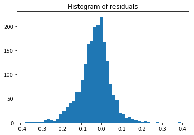</td>
    <td></td>
  </tr>
</table>

---

###  BA / ER

| Model            |     MSE |       R² | Pearson |
| :--------------- | ------: | -------: | ------: |
| **TensorFlow 1** | 11.5073 | -20.2154 |  0.8631 |
| **TensorFlow 2** | 12.7291 | -24.1501 |  0.8540 |

<table>
  <tr>
    <th style="text-align:center;">TensorFlow 1</th>
    <th style="text-align:center;">TensorFlow 2</th>
  </tr>
  <tr>
    <td>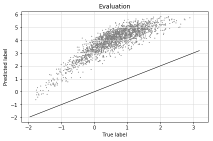</td>
    <td>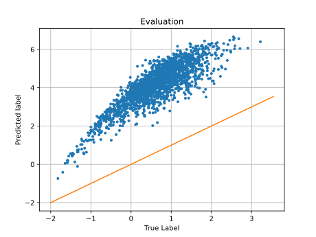</td>
  </tr>
  <tr>
    <td>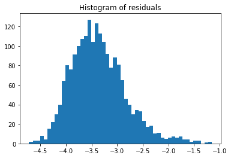</td>
    <td></td>
  </tr>
</table>

---

###  BA / ER (ER)

| Model            |    MSE |       R² | Pearson |
| :--------------- | -----: | -------: | ------: |
| **TensorFlow 1** |  9.0614 |  -7.8326 | 0.7191 |
| **TensorFlow 2** |  9.8371 |  -9.2161 | 0.6728 |

<table>
  <tr>
    <th style="text-align:center;">TensorFlow 1</th>
    <th style="text-align:center;">TensorFlow 2</th>
  </tr>
  <tr>
    <td></td>
    <td></td>
  </tr>
  <tr>
    <td></td>
    <td></td>
  </tr>
</table>

---

### BA / germany50

| Model            |    MSE |       R² | Pearson |
| :--------------- | -----: | -------: | ------: |
| **TensorFlow 1** |  2.2480 |  -4.7743 | 0.9433 |
| **TensorFlow 2** |  3.0866 |  -6.4327 | 0.9656 |

<table>
  <tr>
    <th style="text-align:center;">TensorFlow 1</th>
    <th style="text-align:center;">TensorFlow 2</th>
  </tr>
  <tr>
    <td></td>
    <td></td>
  </tr>
  <tr>
    <td></td>
    <td>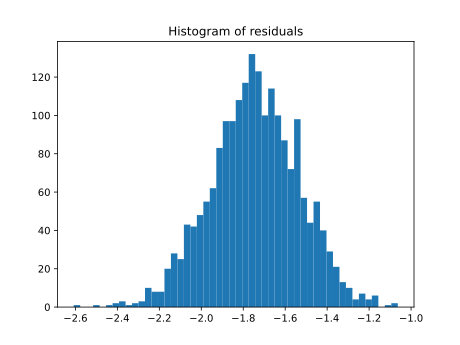</td>
  </tr>
</table>

---

###  BA / SNDlib

| Model            |    MSE |       R² | Pearson |
| :--------------- | -----: | -------: | ------: |
| **TensorFlow 1** |  1.4945 |  -2.3634 | 0.5122 |
| **TensorFlow 2** |  1.1892 |  -5.3225 | 0.9881 |

<table>
  <tr>
    <th style="text-align:center;">TensorFlow 1</th>
    <th style="text-align:center;">TensorFlow 2</th>
  </tr>
  <tr>
    <td>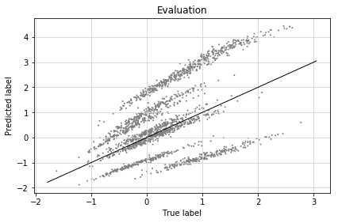</td>
    <td>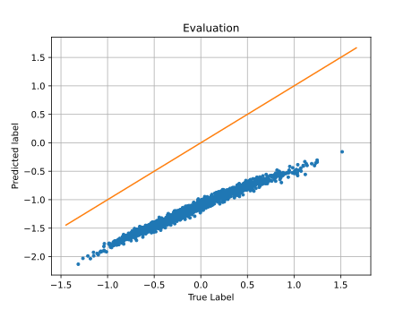</td>
  </tr>
  <tr>
    <td></td>
    <td>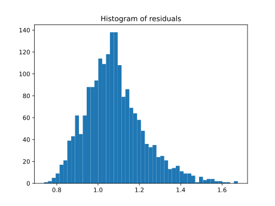</td>
  </tr>
</table>

---

###  ER / ER

| Model            |     MSE |      R² | Pearson |
| :--------------- | ------: | ------: | ------: |
| **TensorFlow 1** |  0.0188 |  0.9817 |  0.9943 |
| **TensorFlow 2** |  0.0225 |  0.9767 |  0.9913 |

<table>
  <tr>
    <th style="text-align:center;">TensorFlow 1</th>
    <th style="text-align:center;">TensorFlow 2</th>
  </tr>
  <tr>
    <td></td>
    <td></td>
  </tr>
  <tr>
    <td></td>
    <td>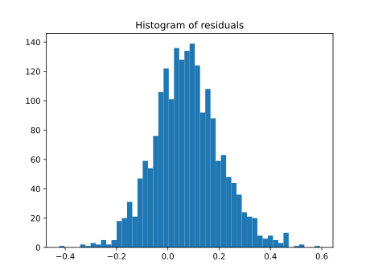</td>
  </tr>
</table>

---

###  ER / BA

| Model            |    MSE |      R² | Pearson |
| :--------------- | -----: | ------: | ------: |
| **TensorFlow 1** | 0.1157 |  0.9371 | 0.9769 |
| **TensorFlow 2** | 0.3080 |  0.8292 | 0.9601 |

<table>
  <tr>
    <th style="text-align:center;">TensorFlow 1</th>
    <th style="text-align:center;">TensorFlow 2</th>
  </tr>
  <tr>
    <td></td>
    <td>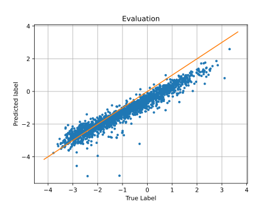</td>
  </tr>
  <tr>
    <td></td>
    <td>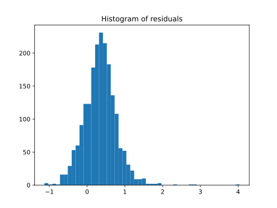</td>
  </tr>
</table>

---

### ER / cost266

| Model            |     MSE |      R² | Pearson |
| :--------------- | ------: | ------: | ------: |
| **TensorFlow 1** |  0.0350 |  0.9362 | 0.9872 |
| **TensorFlow 2** |  0.0379 |  0.9316 | 0.9834 |

<table>
  <tr>
    <th style="text-align:center;">TensorFlow 1</th>
    <th style="text-align:center;">TensorFlow 2</th>
  </tr>
  <tr>
    <td></td>
    <td></td>
  </tr>
  <tr>
    <td>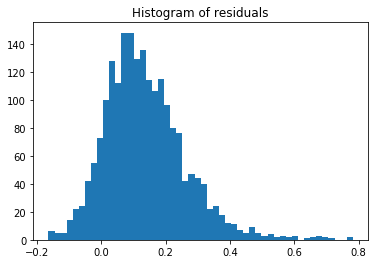</td>
    <td></td>
  </tr>
</table>

---

### ER / ER60

| Model            |     MSE |      R² | Pearson |
| :--------------- | ------: | ------: | ------: |
| **TensorFlow 1** | 0.1146  | 0.9244  | 0.9715 |
| **TensorFlow 2** | 0.3034  | 0.7945  | 0.9559 |

<table>
  <tr>
    <th style="text-align:center;">TensorFlow 1</th>
    <th style="text-align:center;">TensorFlow 2</th>
  </tr>
  <tr>
    <td></td>
    <td></td>
  </tr>
  <tr>
    <td></td>
    <td>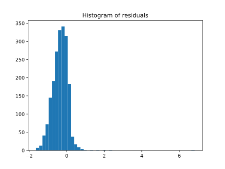</td>
  </tr>
</table>

### ER / germany50

| Model            |    MSE |       R² | Pearson |
| :--------------- | -----: | -------: | ------: |
| **TensorFlow 1** | 0.1946 |  0.7374  | 0.9531 |
| **TensorFlow 2** | 2.4322 | -2.0786 | 0.1746 |

<table>
  <tr>
    <th style="text-align:center;">TensorFlow 1</th>
    <th style="text-align:center;">TensorFlow 2</th>
  </tr>
  <tr>
    <td></td>
    <td>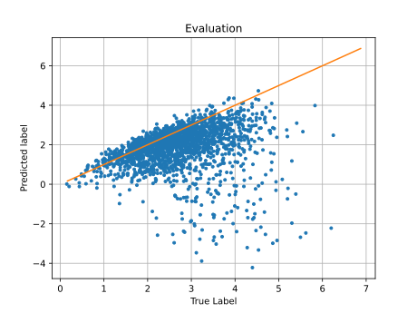</td>
  </tr>
  <tr>
    <td></td>
    <td>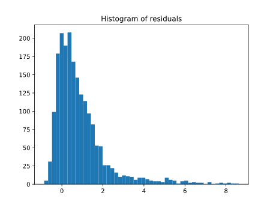</td>
  </tr>
</table>

---

### ER / janos_us

| Model            |     MSE |      R² | Pearson |
| :--------------- | ------: | ------: | ------: |
| **TensorFlow 1** | 0.0206  | 0.9468  | 0.9893 |
| **TensorFlow 2** | 0.0375  | 0.9042  | 0.9864 |

<table>
  <tr>
    <th style="text-align:center;">TensorFlow 1</th>
    <th style="text-align:center;">TensorFlow 2</th>
  </tr>
  <tr>
    <td></td>
    <td></td>
  </tr>
  <tr>
    <td></td>
    <td>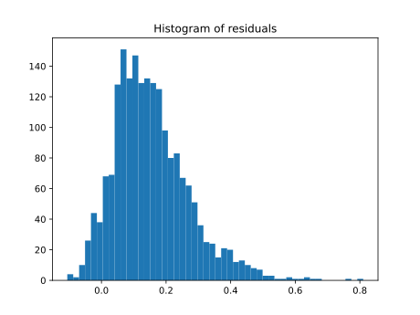</td>
  </tr>
</table>

---

### ER / janos_us_ca

| Model            |     MSE |      R² | Pearson |
| :--------------- | ------: | ------: | ------: |
| **TensorFlow 1** | 0.0427  | 0.9259  | 0.9845 |
| **TensorFlow 2** | 0.0381  | 0.9353  | 0.9788 |

<table>
  <tr>
    <th style="text-align:center;">TensorFlow 1</th>
    <th style="text-align:center;">TensorFlow 2</th>
  </tr>
  <tr>
    <td>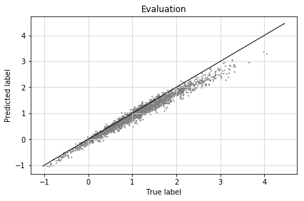</td>
    <td></td>
  </tr>
  <tr>
    <td></td>
    <td>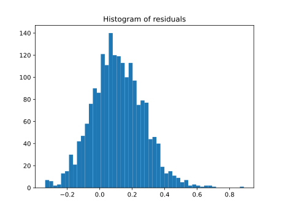</td>
  </tr>
</table>

---

### ER / SNDlib

| Model            |     MSE |      R² | Pearson |
| :--------------- | ------: | ------: | ------: |
| **TensorFlow 1** | 0.0725  | 0.9142  | 0.9776 |
| **TensorFlow 2** | 0.4040  | -0.1290 | 0.8986 |

<table>
  <tr>
    <th style="text-align:center;">TensorFlow 1</th>
    <th style="text-align:center;">TensorFlow 2</th>
  </tr>
  <tr>
    <td>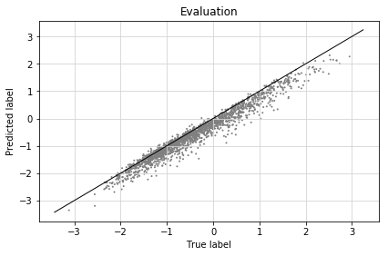</td>
    <td></td>
  </tr>
  <tr>
    <td></td>
    <td></td>
  </tr>
</table>


## 5\. Conclusion

This replication of the experiment by Rusek and Chołda [2] was **successful**. The migration of the legacy TF1 codebase to a compatible TF2 implementation correctly reproduced all the key scientific findings from the original paper.


## 6\. References

[1] K. Rusek, "net2vec," (2018), [Online]. Available: [https://github.com/krzysztofrusek/net2vec/tree/master/mpnn](https://github.com/krzysztofrusek/net2vec/tree/master/mpnn)


[2] K. Rusek and P. Chołda, "Message-Passing Neural Networks Learn Little's Law," in *IEEE Communications Letters*, 2018, doi: 10.1109/LCOMM.2018.2886259


[3] K. Rusek, "Extended results and code explanation supporting paper 'Message-Passing Neural Networks Learn Little's Law'," (2018), [Online]. Available: [https://github.com/krzysztofrusek/net2vec/blob/master/jupyter\_notebooks/LittlesLaw.ipynb](https://github.com/krzysztofrusek/net2vec/blob/master/jupyter_notebooks/LittlesLaw.ipynb)


[4] SNDlib 1.0 - Survivable Network Design Library, [Online]. Available: https://sndlib.put.poznan.pl/home.action
